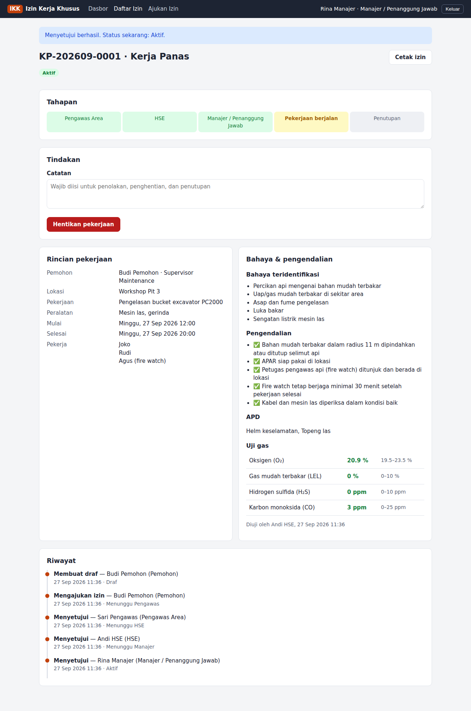
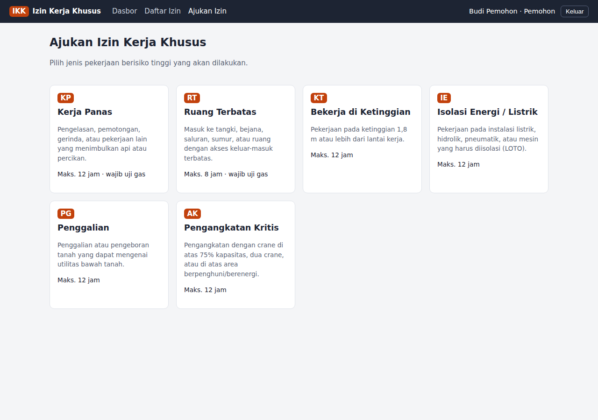
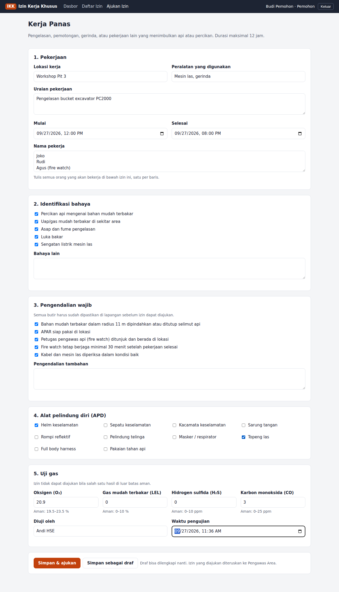
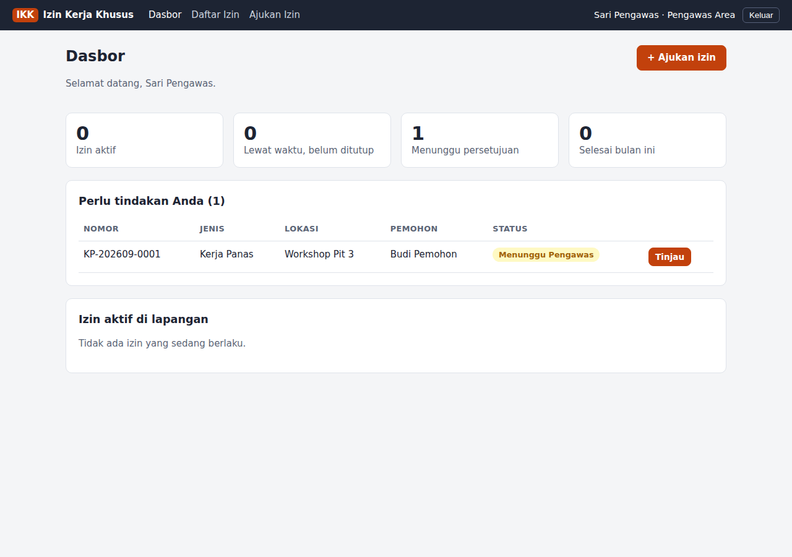
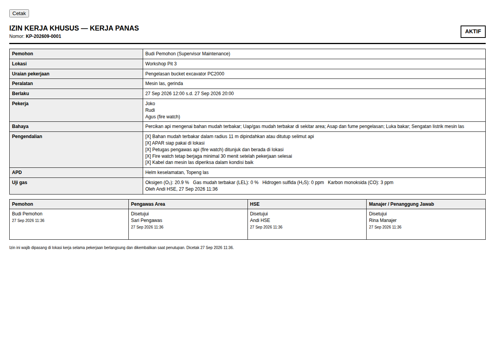

# Izin Kerja Khusus (Permit to Work)

Web app untuk mengajukan, menyetujui, dan menutup **izin kerja khusus** untuk pekerjaan berisiko tinggi, dibangun dengan Laravel.



## Fitur

- **6 jenis izin**: Kerja Panas, Ruang Terbatas, Bekerja di Ketinggian, Isolasi Energi/Listrik (LOTO), Penggalian, dan Pengangkatan Kritis. Setiap jenis punya daftar bahaya, pengendalian wajib, dan durasi maksimal sendiri.
- **Pengendalian wajib**: izin tidak bisa diajukan sebelum semua butir pengendalian dicentang dan minimal satu APD dipilih.
- **Uji gas**: untuk Kerja Panas dan Ruang Terbatas, hasil O₂, LEL, H₂S, dan CO wajib diisi dan harus berada dalam batas aman.
- **Persetujuan berjenjang**: Pengawas Area → HSE → Manajer/Penanggung Jawab. Setiap tahap hanya bisa diputuskan oleh peran yang sesuai, dan **pemohon tidak bisa menyetujui izinnya sendiri**.
- **Penolakan dengan catatan**: pemohon memperbaiki lalu mengajukan ulang dengan nomor izin yang sama.
- **Stop work**: Pengawas, HSE, atau Manajer bisa menghentikan izin aktif kapan saja.
- **Penutupan**: pemohon menyatakan pekerjaan selesai, lalu Pengawas mengonfirmasi area aman.
- **Peringatan lewat waktu** untuk izin aktif yang melewati jam selesai.
- **Nomor otomatis** per jenis per bulan, misalnya `KP-202609-0001`.
- **Riwayat lengkap**: siapa melakukan apa dan kapan.
- **Cetak izin** untuk dipasang di lokasi kerja, lengkap dengan kolom persetujuan.
- **Kelola pengguna dan peran** (khusus admin).

## Alur status

```
Draf ──ajukan──▶ Menunggu Pengawas ──▶ Menunggu HSE ──▶ Menunggu Manajer ──▶ Aktif
  ▲                     │                   │                  │               │
  └──── Ditolak ◀───────┴───────────────────┴──────────────────┘               │
                                                                               ├─▶ Dihentikan
                                          Selesai ◀── Menunggu Penutupan ◀─────┘
```

Selama belum aktif, pemohon juga bisa membatalkan izinnya.

## Menjalankan di komputer sendiri

Butuh PHP 8.3+ dan Composer.

```bash
git clone https://github.com/muhammadseptiadi079/izin-kerja-khusus.git
cd izin-kerja-khusus
composer install
cp .env.example .env
php artisan key:generate
touch database/database.sqlite
php artisan migrate --seed
php artisan serve
```

Buka http://localhost:8000 dan masuk dengan salah satu akun contoh (kata sandi semuanya `password`):

| Email | Peran |
| --- | --- |
| `pemohon@contoh.id` | Pemohon |
| `pengawas@contoh.id` | Pengawas Area |
| `hse@contoh.id` | HSE |
| `manajer@contoh.id` | Manajer / Penanggung Jawab |
| `admin@contoh.id` | Administrator |

> Ganti kata sandi atau nonaktifkan akun contoh sebelum dipakai sungguhan.

Untuk MySQL, ubah `DB_CONNECTION=mysql` dan isi `DB_HOST`, `DB_DATABASE`, `DB_USERNAME`, `DB_PASSWORD` di `.env`.

## Menyesuaikan aturan

Semua jenis izin, bahaya, pengendalian, batas uji gas, daftar APD, dan urutan persetujuan ada di [`config/izin.php`](config/izin.php). Ubah di sana tanpa perlu menyentuh kode lain.

## Pengujian

```bash
php artisan test
```

## Tangkapan layar

| Pilih jenis izin | Formulir |
| --- | --- |
|  |  |
| **Dasbor Pengawas** | **Cetak izin** |
|  |  |
