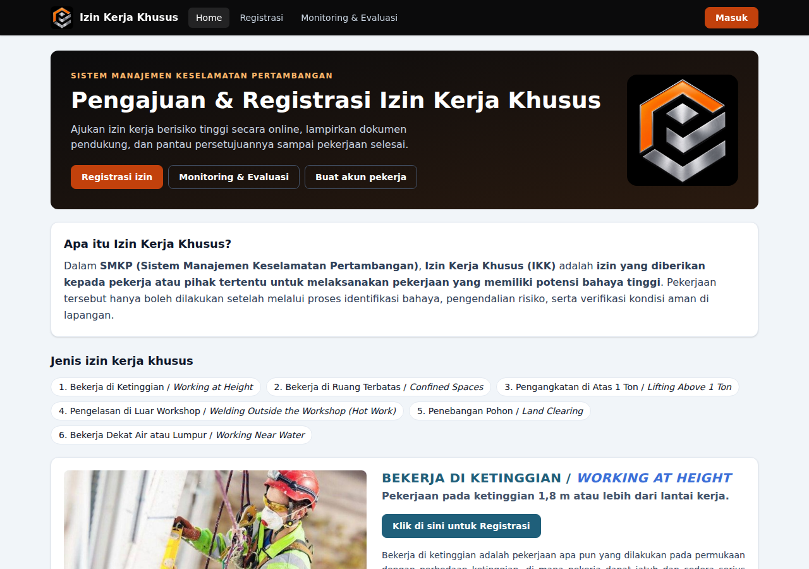
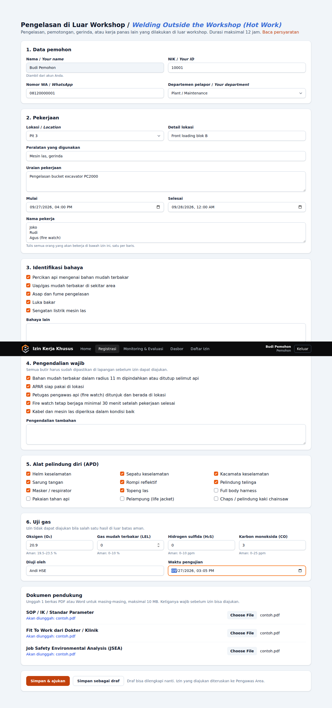
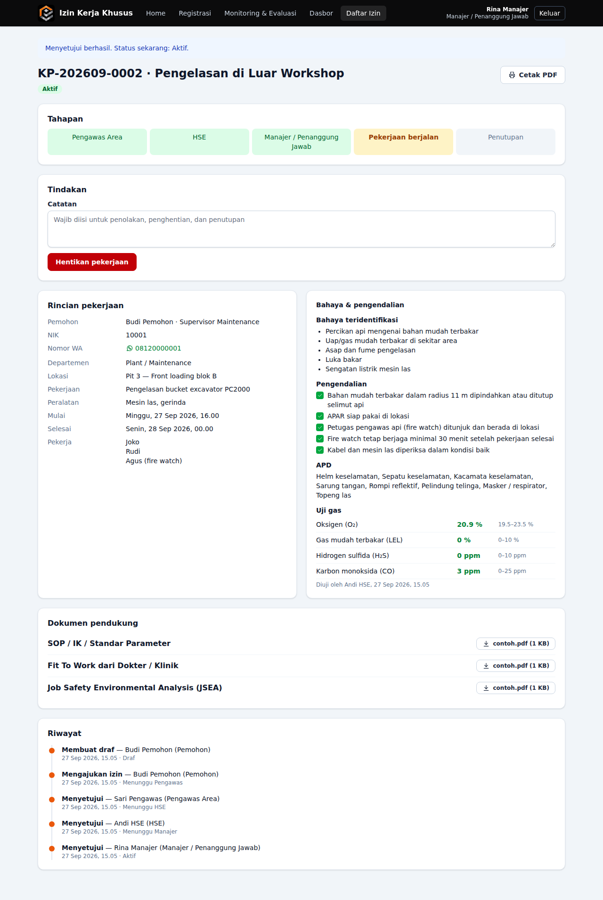
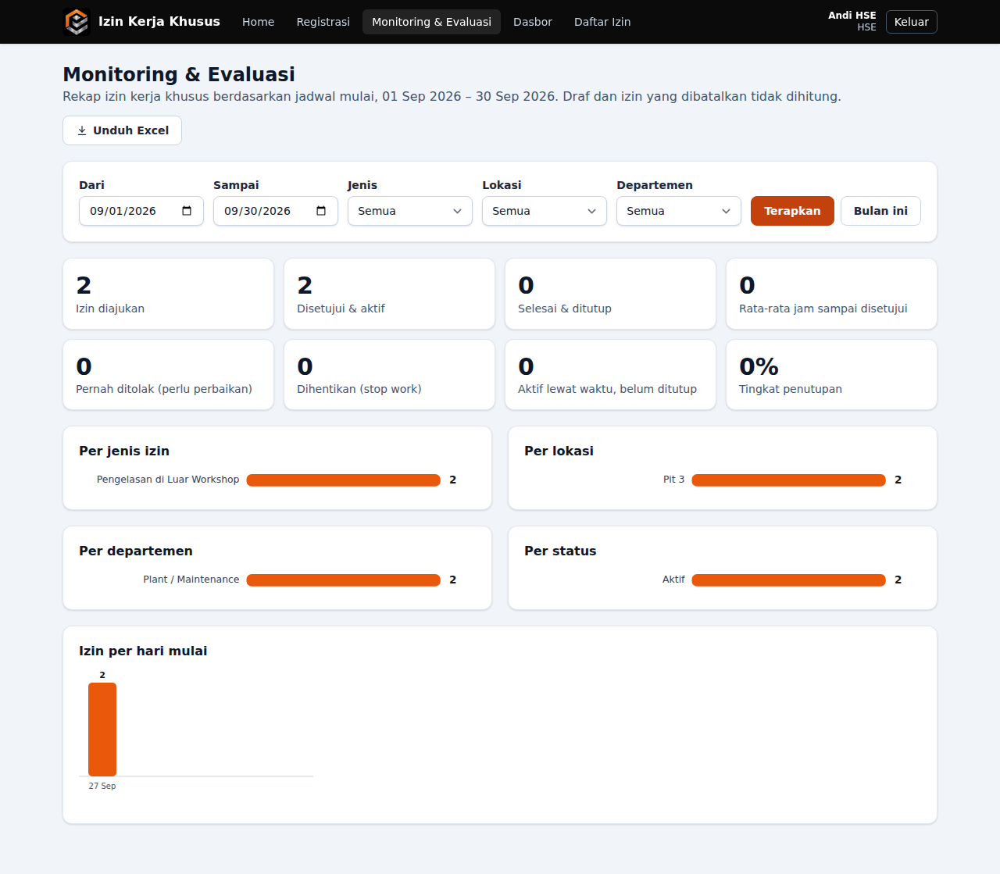
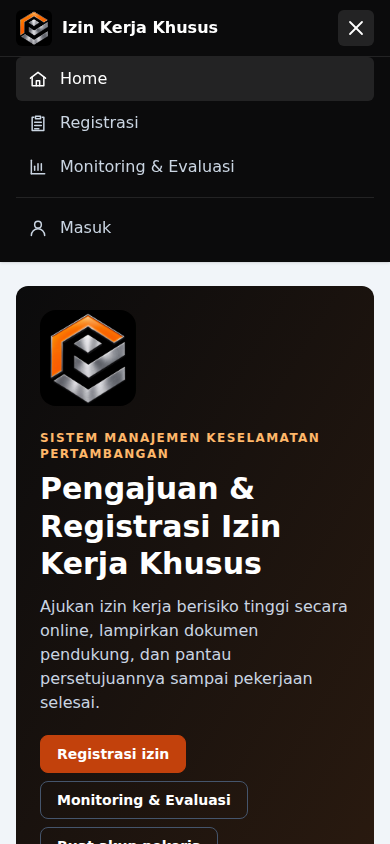

# Izin Kerja Khusus (Permit to Work)

Web app untuk mengajukan, menyetujui, dan menutup **izin kerja khusus (IKK)** untuk pekerjaan berisiko tinggi sesuai SMKP.



## Teknologi

| Bagian | Yang dipakai |
| --- | --- |
| Backend | PHP 8.4, Laravel 13, Inertia.js |
| Frontend | Vue 3, TypeScript, Tailwind CSS v4, Vite |
| Database | SQLite (bawaan) atau PostgreSQL / Supabase |
| Paket | Laravel Breeze (login, daftar, lupa sandi, profil), barryvdh/laravel-dompdf (cetak izin PDF), maatwebsite/excel (ekspor rekap), Google Gemini API (saran AI) |
| Grafik & ikon | SVG native, tanpa pustaka tambahan |
| Hosting | VPS atau Vercel + Supabase, lihat [docs/DEPLOY.md](docs/DEPLOY.md) |
| Pengujian & alat | Pest (di atas PHPUnit), Laravel Pint, Laravel Pail |

## Fitur

- **Menu Home, Registrasi, dan Monitoring & Evaluasi**, seperti situs IKK sebelumnya.
- **6 jenis izin**: Bekerja di Ketinggian (*Working at Height*), Bekerja di Ruang Terbatas (*Confined Spaces*), Pengangkatan di Atas 1 Ton (*Lifting*), Pengelasan di Luar Workshop (*Hot Work*), Penebangan Pohon (*Land Clearing*), dan Bekerja Dekat Air atau Lumpur (*Working Near Water*). Masing-masing punya halaman sendiri dengan foto, penjelasan, bahaya, pengendalian wajib, dan tombol "Klik di sini untuk Registrasi".
- **Formulir registrasi**: nama, NIK, nomor WA, departemen, lokasi, uraian pekerjaan, pekerja, identifikasi bahaya, pengendalian, APD, dan uji gas.
- **Dokumen wajib**: SOP / IK / Standar Parameter, Fit To Work dari Dokter / Klinik, dan JSEA (PDF/Word, maks. 10 MB). Hanya pemohon dan penyetuju yang bisa mengunduhnya.
- **Syarat sebelum diajukan**: semua pengendalian wajib dicentang, dokumen lengkap, durasi tidak melebihi batas jenisnya, dan uji gas (Pengelasan & Ruang Terbatas) dalam batas aman. Bila belum, izin tetap tersimpan sebagai draf dan semua kekurangannya ditampilkan.
- **Saran AI (Google Gemini)**: dari uraian pekerjaan, AI menyarankan bahaya, bahaya lain, pengendalian tambahan, dan APD. AI **tidak** mencentang pengendalian wajib; itu tetap dipastikan pemohon di lapangan.
- **Persetujuan berjenjang**: Pengawas Area → HSE → Manajer/Penanggung Jawab. Setiap tahap hanya diputuskan peran yang sesuai, dan **pemohon tidak bisa menyetujui izinnya sendiri**.
- **Tolak dengan catatan**, lalu pemohon memperbaiki dan mengajukan ulang dengan nomor yang sama.
- **Stop work**: Pengawas, HSE, atau Manajer bisa menghentikan izin aktif.
- **Penutupan**: pemohon menyatakan pekerjaan selesai, Pengawas mengonfirmasi area aman.
- **Cetak izin sebagai PDF** dengan logo, kolom persetujuan, dan daftar dokumen.
- **Monitoring & Evaluasi**: grafik per jenis, lokasi, departemen, status, dan hari; tingkat penutupan, izin yang pernah ditolak, stop work, rata-rata waktu persetujuan; **unduh Excel (.xlsx)**.
- **Akun**: pekerja bisa mendaftar sendiri (otomatis sebagai pemohon); peran penyetuju hanya diberikan admin. Admin juga bisa menonaktifkan akun.
- **Riwayat lengkap** dan **nomor otomatis** per jenis per bulan, misalnya `KP-202609-0001`.

## Alur status

```
Draf ──ajukan──▶ Menunggu Pengawas ──▶ Menunggu HSE ──▶ Menunggu Manajer ──▶ Aktif
  ▲                     │                   │                  │               │
  └──── Ditolak ◀───────┴───────────────────┴──────────────────┘               │
                                                                               ├─▶ Dihentikan
                                          Selesai ◀── Menunggu Penutupan ◀─────┘
```

Selama belum aktif, pemohon juga bisa membatalkan izinnya.

## Menjalankan di komputer sendiri

Butuh PHP 8.4, Composer, dan Node.js 22.

```bash
git clone https://github.com/muhammadseptiadi079/izin-kerja-khusus.git
cd izin-kerja-khusus
composer install
cp .env.example .env
php artisan key:generate
touch database/database.sqlite
php artisan migrate --seed
npm install
composer dev
```

`composer dev` menjalankan server Laravel, Vite (hot reload), antrean, dan **Laravel Pail** (log) sekaligus. Buka http://localhost:8000 dan masuk dengan akun contoh (kata sandi semuanya `password`):

| Email | Peran |
| --- | --- |
| `pemohon@contoh.id` | Pemohon |
| `pengawas@contoh.id` | Pengawas Area |
| `hse@contoh.id` | HSE |
| `manajer@contoh.id` | Manajer / Penanggung Jawab |
| `admin@contoh.id` | Administrator |

> Ganti kata sandi atau nonaktifkan akun contoh sebelum dipakai sungguhan.

Untuk mengaktifkan **Saran AI**, isi `GEMINI_API_KEY` di `.env` (kunci dari https://aistudio.google.com/apikey).

## Perintah pengembangan

| Perintah | Fungsi |
| --- | --- |
| `composer dev` | Server + Vite + antrean + Pail |
| `php artisan test` atau `./vendor/bin/pest` | Semua tes (Pest) |
| `composer lint` | Rapikan kode PHP dengan Pint |
| `composer lint:cek` | Cek format tanpa mengubah (untuk CI) |
| `npm run build` | Cek TypeScript (`vue-tsc`) lalu build aset |
| `php artisan pail` | Pantau log secara langsung |

## Menyesuaikan aturan

Semua jenis izin, penjelasan, bahaya, pengendalian, **daftar lokasi**, **daftar departemen**, dokumen wajib, batas uji gas, daftar APD, dan urutan persetujuan ada di [`config/izin.php`](config/izin.php). Ubah di sana tanpa perlu menyentuh kode lain.

### Mengganti foto jenis izin

Foto ada di `public/img/jenis/`, dinamai sesuai kunci jenisnya (`ketinggian`, `ruang_terbatas`, `pengangkatan`, `kerja_panas`, `penebangan_pohon`, `dekat_air`). Taruh berkas `.jpg`, `.png`, atau `.webp` dengan nama itu; foto otomatis dipakai menggantikan ilustrasi `.svg` bawaan. Ukuran yang disarankan 1280×720 (16:9).

## Struktur singkat

```
app/Support/AlurIzin.php        perpindahan status dan siapa yang boleh melakukannya
app/Support/PemeriksaIzin.php   syarat sebelum izin bisa diajukan
app/Services/AsistenGemini.php  saran AI dari Google Gemini
app/Exports/RekapIzinExport.php ekspor Excel
resources/js/Pages/             halaman Vue (Inertia)
resources/views/pdf/izin.blade.php  template PDF izin
config/izin.php                 semua aturan izin
```

## Tangkapan layar

| Registrasi izin | Izin aktif |
| --- | --- |
|  |  |
| **Monitoring & Evaluasi** | **Tampilan HP** |
|  |  |
